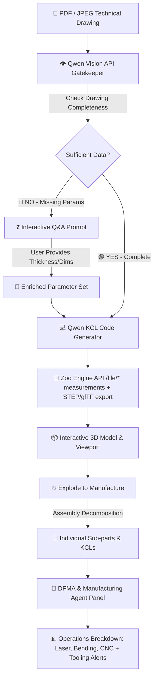

# 🛠️ Zoo Auto-CAD & DFMA Agent: Technical Drawing to KCL 3D Pipeline

> **Submitted for Zoo The API Makeathon**  
> *Transform technical drawings (PDF/JPEG) into KittyCAD KCL code, interactive 3D CAD models, exploded manufacturing parts, and automated DFMA (Design for Manufacture and Assembly) insights.*

---

## 📹 Demo Video

<!-- 
TO ATTACH YOUR DEMO VIDEO:
1. Open this README.md file in GitHub's web editor.
2. Drag & drop your ~1 minute MP4 video into this section.
3. Save/Commit the changes.
-->


> 🎬 *Watch how a multi-part PDF technical drawing is evaluated, enriched via AI Q&A, compiled to KCL in Zoo Engine, exploded into components, and analyzed for DFMA manufacturing operations.*

---

## 🎯 The Problem

Engineering and manufacturing teams frequently face bottlenecked workflows when converting **PDF / 2D technical drawings** into production-ready **3D CAD models** and manufacturing process plans:

1. **Incomplete Technical Drawings**: Drawings often lack critical parameters (e.g., sheet metal thickness, bend radii, hole diameters, surface finishes). Traditional CAD creation stalls until engineers manually identify and resolve missing data.
2. **Manual 3D CAD Recreation**: Rebuilding 3D models manually in standard CAD tools takes hours or days.
3. **Assembly Breakdown Delay**: Splitting assembly drawings into individual, manufacturable parts requires manual effort and verification.
4. **DFMA Blindspots**: Design for Manufacture and Assembly rules (e.g., laser minimum hole diameter vs thickness, CNC tool clearance, bend relief) are checked late in the production cycle, causing costly re-spins.

---

## 💡 Why We Chose This Solution

We combined **Qwen Vision AI** with **Zoo's KittyCAD Engine (KCL)** to create a closed-loop **AI-to-CAD & Manufacturing Intelligence Pipeline**:

- **Qwen Vision API**: Acts as the gatekeeper. It "reads" engineering drawings, checks parameter completeness, interactively prompts the user for any missing data, generates precise KittyCAD Language (KCL) code, and decomposes assemblies.
- **Zoo Engine APIs (`api.zoo.dev`)**: Serves as the ultimate CAD execution engine. It compiles KCL code into exact 3D parametric geometry, generates renders/STEP files, and provides geometric properties.
- **Automated DFMA & Manufacturing Agent**: Analyzes the resulting part geometry and KCL code to output instant manufacturing operations (Laser Cutting, CNC Bending, Machining) and cost/tooling alerts.

---

## 🔄 How It Works (Architecture & Pipeline)



### 1. Manufacturability Gatekeeper (Qwen-VL)
When a PDF or image is uploaded, Qwen-VL performs a drawing completeness audit. If key information (such as plate thickness or thread size) is ambiguous or missing, the system pauses and asks the user targeted questions.

### 2. KCL Generation & Zoo Engine API Integration
Once verified, the AI synthesizes code in **KCL (KittyCAD Language)**. The KCL solid is reconstructed by the backend and dispatched to **Zoo Engine's REST API** (`https://api.zoo.dev/file/volume`, `/file/surface-area`, `/file/mass`, `/file/center-of-mass`, `/file/conversion/stl/{step|gltf}`). The engine returns **real measured geometry** (volume, surface area, mass by material density, center of mass) and exports the model to STEP + glTF for download.

### 3. Assembly Exploded View & Part Decomposition
Clicking **"Explode to Manufacture"** prompts the pipeline to inspect multi-part drawings, separate individual components, and generate isolated KCL models for each piece.

### 4. Agentic Engineering Loop (Zookeeper + Zoo Engine + Critic)
The headline feature of this makeathon submission is a **self-consistent agentic loop** that forces the AI-generated CAD geometry to actually *match the drawing*:

1. **Zookeeper (Agent API — `wss://api.zoo.dev/ws/ml/copilot`)** plays the *lead design engineer*: it looks at the attached drawing image and proposes a welded/laser-cut/turned part breakdown (POZ list) with exact L×W×H / radius dimensions that must reproduce the drawing's bounding-box envelope.
2. **Zoo Engine REST API** measures **every proposed part for real** (`/file/volume`, `/file/surface-area`, `/file/mass` with material density, `/file/center-of-mass`) and exports each to STEP + glTF.
3. A **critic** compares the measured assembly envelope to the vision-derived drawing envelope (e.g. `496 x 260 x 132 mm`). If any dimension is off by more than 20%, the exact discrepancy is fed back to Zookeeper, which revises its proposal.
4. The loop **iterates until the geometry holds** (usually 1–3 passes), then renders a **2D technical drawing sheet** (orthographic front/top/side views, title block, BOM, real per-part engine masses).

API endpoints:
- `POST /api/engineering-loop/start` — open a session (Zookeeper conversation + drawing context).
- `POST /api/engineering-loop/iterate` — one engineer → measure → critic pass.
- `GET /api/engineering-loop/state/{session_id}` — current loop state.

### 5. DFMA & Manufacturing Operations Panel
The right-hand agent analyzes the 3D geometry against manufacturing constraints:
- **Sheet Metal Bending**: Bend allowance, min flange height, bend relief checks.
- **Laser / Plasma Cutting**: Min hole diameter relative to sheet thickness.
- **CNC Milling / Turning**: Tool clearance and corner fillet radii.
- **Process Routing**: Step-by-step manufacturing sequence (e.g. Cut -> Bend -> Tap -> Surface Coat).

---

## 🛠️ Tech Stack

- **Backend**: Python 3.10+, FastAPI, Uvicorn
- **AI Vision Engine**: Qwen-VL (via DashScope / OpenAI compatible API)
- **CAD & Geometry Engine**: [Zoo Engine APIs](https://zoo.dev/) & KittyCAD KCL
- **Frontend**: HTML5, Modern CSS Glassmorphism Studio UI, JavaScript ES6+
- **PDF Processing**: Pillow, PyPDF2 / pdf2image

---

## 🚀 Setup & Installation Instructions

### Prerequisites
- Python 3.10 or higher
- A Zoo API Key ([Get one at zoo.dev](https://zoo.dev/))
- A Qwen API Key (Alibaba Cloud / DashScope or compatible endpoint)

### 1. Clone the Repository
```bash
git clone https://github.com/kuntaykunt/zoo-the-api-makeathon.git
cd zoo-the-api-makeathon
```

### 2. Create a Virtual Environment & Install Dependencies
```bash
python3 -m venv venv
source venv/bin/activate
pip install -r requirements.txt
```

### 3. Configure Environment Variables
Copy `.env.example` to `.env` and enter your API keys:
```bash
cp .env.example .env
```
Edit `.env`:
```env
QWEN_API_KEY=your_qwen_api_key_here
ZOO_API_KEY=your_zoo_api_key_here
PORT=8000
```

### 4. Run the Application
```bash
python main.py
```
Open your browser and navigate to:
👉 **`http://localhost:8000`**

---

## 📜 License

Distributed under the MIT License. See `LICENSE` for more information.

---
*Built with ❤️ for the Zoo The API Makeathon by Kuntay Kunt.*
