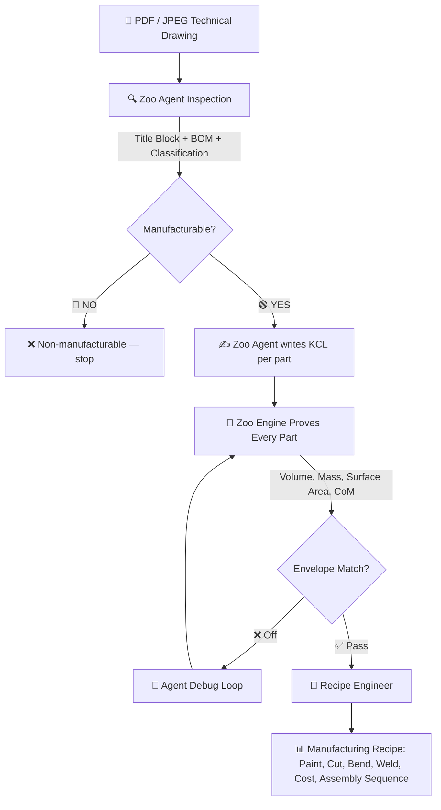

# 🛠️ Zoo Auto-CAD & DFMA Agent: Technical Drawing to KCL 3D Pipeline

> **Submitted for Zoo The API Makeathon**
> *Transform technical drawings (PDF/JPEG) into KittyCAD KCL code, real engine measurements, and automated manufacturing recipes.*

---

## 📹 Demo Video

[](https://youtu.be/16waDuBfj_k)

> 🎬 *Watch the full pipeline: technical drawing → Zoo Agent inspection → multi-file KCL → Engine measurements → Recipe Engineer manufacturing plan.*

---

## 🎯 The Problem

Engineering and manufacturing teams face bottlenecked workflows when converting **PDF / 2D technical drawings** into production-ready **3D CAD models** and manufacturing process plans. Drawings often lack critical parameters, and traditional CAD recreation takes hours or days.

---

## 💡 Why We Chose This Solution

We built a **3-actor agentic pipeline** where each actor does what it's best at:

| Actor | Role | API |
|---|---|---|
| **Zoo Agent** (ML Copilot) | Drawing inspector — reads technical drawings, extracts BOM, classifies manufacturing process, writes multi-file KCL per part | `wss://api.zoo.dev/ws/ml/copilot` |
| **Zoo Engine API** | CAD execution — measures every part for real (volume, mass, surface area, center of mass), constraint checks, debugs KCL | `api.zoo.dev/file/*` |
| **Recipe Engineer** (Qwen) | Manufacturing reasoning — paint calculation, cut length, bend count, weld seams, assembly sequence, cost estimate | Qwen API |

---

## 🔄 How It Works (Architecture & Pipeline)



### Stage 1: Zoo Agent Inspection
The Zoo ML Copilot agent inspects the technical drawing. It classifies the manufacturing process (sheet-metal, machined, cast, forged), extracts the Bill of Materials with POZ positions, and writes authentic KittyCAD KCL files — one per part — using the `edit_kcl_code` tool. The agent identifies geometry natively and knows engine limitations.

### Stage 2: Zoo Engine Prove + Debug
Every part is submitted to the Zoo Engine API for real measurement: volume, surface area, mass (by material density), and center of mass. The assembly envelope is compared against the drawing target. If dimensions are off, the agent enters a debug loop to fix the KCL — switching geometric strategies when engine limitations are hit (e.g., 3D subtraction → positive geometry).

### Stage 3: Recipe Engineer
Engine measurements are passed to the Recipe Engineer, which reasons about manufacturing:
- **Surface finishing**: paint required per part (surface_area × qty → liters)
- **Cutting**: laser cut perimeter length and estimated cycle time
- **Bending**: bend count and press brake time
- **Welding**: weld seam length estimation
- **Assembly sequence**: optimal manufacturing order
- **Cost estimate**: material + labor per part

### API Endpoints
- `POST /api/upload-drawing` — upload technical drawing, extract title block
- `POST /api/engineering-loop/start` — open a Zoo Agent engineering session
- `POST /api/engineering-loop/iterate` — advance one stage (3 stages total)
- `GET /api/engineering-loop/state/{session_id}` — current loop state with KCL files, measurements, recipe

---

## 🛠️ Tech Stack

- **Backend**: Python 3.10+, FastAPI, Uvicorn
- **CAD Agent**: Zoo ML Copilot (`/ws/ml/copilot`) — KCL authoring, constraint checking, debugging
- **CAD Engine**: Zoo Engine APIs (`/file/volume`, `/file/surface-area`, `/file/mass`, `/file/center-of-mass`)
- **Recipe AI**: Qwen API — manufacturing recipe reasoning
- **Frontend**: HTML5, CSS Glassmorphism Studio UI, JavaScript ES6+
- **PDF Processing**: PyMuPDF (fitz), Pillow

---

## 🚀 Setup & Installation Instructions

### Prerequisites
- Python 3.10 or higher
- A Zoo API Key ([Get one at zoo.dev](https://zoo.dev/))
- A Qwen API Key (Alibaba Cloud / DashScope or compatible endpoint)

### 1. Clone the Repository
```bash
git clone https://github.com/kuntaykunt/zoo-the-api-makeathon.git
cd zoo-the-api-makeathon
```

### 2. Create a Virtual Environment & Install Dependencies
```bash
python3 -m venv venv
source venv/bin/activate
pip install -r requirements.txt
```

### 3. Configure Environment Variables
Copy `.env.example` to `.env` and enter your API keys:
```bash
cp .env.example .env
```
Edit `.env`:
```env
QWEN_API_KEY=your_qwen_api_key_here
ZOO_API_KEY=your_zoo_api_key_here
PORT=8000
```

### 4. Run the Application
```bash
python main.py
```
Open your browser and navigate to:
👉 **`http://localhost:8000`**

---

## 📜 License

Distributed under the MIT License. See `LICENSE` for more information.

---
*Built with ❤️ for the Zoo The API Makeathon by Kuntay Kunt.*